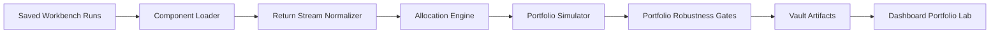

# WORKBENCH-PORTFOLIO-001 Design

## Purpose

The next research step is not another single "magic" strategy. It is a governed
portfolio-of-strategies diagnostic that composes saved Workbench runs and asks a
harder question:

> Can several imperfect, audited strategy components produce a better risk-adjusted
> research profile when they are combined under strict allocation and robustness
> gates?

The engine must not imply promotion, paper trading, live trading, or real edge.
It is a local diagnostic layer over already-saved Workbench artifacts.

## Context From The Vault

The Workbench V2/V3 vault report records the current contract:

- strategies are converted into manifest, pre-run gate, data contract, command
  spec, risk policy, README, and dry-run report;
- package generation is non-executing;
- package inspection can mark a package ready for runner build, but not ready for
  execution;
- the first diagnostic package runner consumes saved packages and emits a local
  `final_decision.json`;
- provider queries, paper trading, live trading, and promotion remain forbidden.

The portfolio engine must preserve this posture. It is a diagnostic composer, not
an authorization layer.

## Context From Graphify

Graphify scanned `src` on 2026-05-23 and reported:

- 138 files;
- 1,484 nodes;
- 3,498 edges;
- 65 communities;
- graph structure is useful at this size.

The report highlights cross-community bridge nodes such as `run_milestone_1()`,
`run_walk_forward_validation()`, and `run_small_cap_portfolio_backtest()`. That
matters because portfolio logic should not be buried inside `dashboard/app.py`.
The implementation should follow the existing pattern:

- pure computation in a focused module;
- dashboard functions as presentation and orchestration;
- tests around the computation module and artifact contracts;
- vault artifacts for every final diagnostic.

## Problem

Single strategy testing has been useful but too brittle:

- many price-based strategies fail through costs;
- some dry-runs look attractive but depend on top winners;
- active-only universes remain non-promotable;
- catalyst strategies can be convex but need portfolio-style judgment;
- current Workbench cards compare runs individually, not as an ensemble.

The user-facing question is now:

> What happens if I combine several strategy components that behave differently?

The scientific question is stricter:

> Does the combined return stream survive correlation, concentration, drawdown,
> cost stress, and best-component removal?

## Non-Goals

WORKBENCH-PORTFOLIO-001 will not:

- query providers;
- download market data;
- paper trade;
- live trade;
- promote a portfolio;
- optimize weights to maximize historical Sharpe;
- hide survivorship or proxy-data warnings;
- treat active-only Workbench runs as institutionally valid evidence.

## Approaches Considered

### Approach A: Simple Saved-Run Basket

Load saved `dry_run_result.json`, `trade_list.csv`, and `equity_curve.csv` files,
assign weights, and compute portfolio diagnostics.

Pros:

- fast;
- uses existing artifacts;
- zero provider risk;
- ideal first implementation.

Cons:

- depends on simplified local dry-run outputs;
- no true capital overlap modeling yet.

### Approach B: Package-Level Portfolio Runner

Compose `strategy_package` directories and call the diagnostic package runner for
each package before portfolio construction.

Pros:

- stronger audit trail;
- uses the newer V3 package contract;
- closer to future real-run architecture.

Cons:

- current package runner blocks packages that allow provider queries;
- more moving parts for first version.

### Approach C: Full Real Backtest Portfolio Engine

Convert selected strategies into real pre-run gates and run a true portfolio
backtest with external data.

Pros:

- most realistic eventual target.

Cons:

- requires data approvals and real runners;
- too large for the next step;
- would mix research design with execution authorization.

## Recommended Path

Build Approach A first, but design the artifact schema so Approach B can plug in
later.

This gives the lab a clean Portfolio Diagnostic mode without weakening governance.
The portfolio can say "interesting research basket" but never "tradable system".

## Core Architecture



## Component Loader

Input sources:

- `dry_run_result.json`;
- `trade_list.csv`;
- `equity_curve.csv`;
- `strategy_manifest.json`;
- optional `strategy_package/risk_policy.json`;
- optional `strategy_package/data_contract.json`.

Each component becomes a `PortfolioComponent`:

```json
{
  "component_id": "dcfbeec9cf4c5190",
  "strategy_name": "strategia folle",
  "template": "PDUFA Run-Up",
  "analysis_mode": "Trading",
  "decision": "RESEARCH_CANDIDATE_ONLY",
  "promotion_allowed": false,
  "bias_warnings": ["PROXY_DATA_SCOPE_NOT_PROMOTABLE"],
  "trade_count": 120,
  "net_return_sum": 29.116515,
  "artifact_dir": "experiments/.../USER-STRATEGY-WORKBENCH/dcfbeec9cf4c5190"
}
```

Eligibility rules:

- component must have a saved dry-run result;
- component must have trade or equity artifacts;
- component can be included even if rejected, but receives a red badge;
- component cannot be marked promoted;
- component with active-only/PIT warnings remains non-promotable at portfolio
  level.

## Return Stream Normalizer

Problem: each strategy produces trades, not a clean daily portfolio series.

First version:

- use `equity_curve.csv` when present;
- otherwise rebuild from `trade_list.csv`;
- align components by event index if dates are missing;
- align by dates when entry/exit dates exist;
- fill missing component returns with zero exposure, not synthetic returns;
- record alignment mode in the audit.

Output:

- `component_return_matrix.csv`;
- rows are dates or ordered local events;
- columns are strategy components;
- values are component net returns after declared costs.

## Allocation Engine

Version 1 supports three allocation policies.

### Equal Weight

Every selected strategy receives the same weight.

Use when:

- testing whether the ensemble itself adds value;
- avoiding optimization.

### Inverse Volatility

Lower-volatility components get larger weights, capped by a maximum component
weight.

Use when:

- strategy return streams have different volatility;
- reducing concentration.

### Sleeve Allocation

Explicit buckets:

- Core sleeve: stable/reversion/regime components;
- Convex sleeve: PDUFA/catalyst/lottery-like components;
- Tactical sleeve: ORB/intraday/custom rules.

Example default:

- Core: 60%;
- Convex: 20%;
- Tactical: 20%;
- max single component: 25%;
- max rejected component: 10%;
- max active-only proxy component: 10%.

This is the recommended default because it matches the lab's history: catalyst
ideas may be valuable, but they must not dominate the portfolio.

## Portfolio Simulator

The simulator computes:

- weighted return per period;
- cumulative equity;
- drawdown;
- exposure count;
- contribution by strategy;
- contribution by template family;
- contribution by period;
- cost-adjusted total return;
- portfolio turnover proxy;
- time underwater.

It must never compound ambiguous dry-run returns into a live-trading claim. The
dashboard copy must call the result a "local diagnostic portfolio".

## Portfolio Gates

The portfolio gates are different from single-strategy gates.

### Data Contract Gate

Blocks promotion language if any component is:

- active-only;
- proxy-only;
- missing PIT/delisted coverage;
- built from a local dry-run rather than a real governed backtest.

Expected first-version status: always `DIAGNOSTIC_ONLY`.

### Component Count Gate

Requires at least:

- 3 components for a toy portfolio;
- 5 components for a research basket label;
- 8 components for any serious ensemble diagnostic.

### Component Concentration Gate

Blocks if:

- top component contributes more than 40% of positive return;
- top 2 components contribute more than 65%;
- portfolio dies after removing the best component.

### Strategy Family Concentration Gate

Blocks if:

- more than 60% of capital or return comes from one template family;
- all positive contribution comes from one symbol or one event family.

### Correlation Gate

Warns or blocks if:

- average absolute pairwise correlation is too high;
- too many strategies lose together in the same periods;
- correlation matrix shows one hidden common factor.

### Drawdown Gate

Requires:

- max drawdown reported visibly;
- time underwater reported visibly;
- worst 5-period stretch reported visibly.

The gate does not block solely because drawdown exists. It blocks if drawdown is
large while return is dependent on a small number of winners.

### Ex-Best Component Gate

Replays portfolio after removing:

- best component;
- best 2 components;
- best 10% of periods.

The portfolio is fragile if the sign flips or drawdown becomes unacceptable.

### Cost Stress Gate

Replays with:

- declared cost;
- 1.5x cost;
- 2.0x cost.

The dashboard must show whether the portfolio survives realistic friction.

### Regime Balance Gate

Maps component returns by available regime labels when present.

Warns if:

- all returns occur in one market regime;
- all components fail in drawdown-stress regimes;
- strategy weights do not match the regime exposure.

## Final Decisions

Allowed decisions:

- `PORTFOLIO_DIAGNOSTIC_COMPLETE_NO_PROMOTION`;
- `PORTFOLIO_RESEARCH_BASKET_CANDIDATE_ONLY`;
- `PORTFOLIO_ARCHIVE_CONCENTRATION_FAILED`;
- `PORTFOLIO_ARCHIVE_COST_STRESS_FAILED`;
- `PORTFOLIO_ARCHIVE_DATA_CONTRACT_FAILED`;
- `PORTFOLIO_ARCHIVE_INSUFFICIENT_COMPONENTS`;
- `PORTFOLIO_ARCHIVE_EX_BEST_COMPONENT_FAILED`.

Forbidden decisions:

- anything containing `PROMOTED`;
- anything containing `PAPER_READY`;
- anything containing `LIVE_READY`.

## Artifacts

Each portfolio run writes:

- `portfolio_manifest.json`;
- `component_manifest.csv`;
- `component_return_matrix.csv`;
- `allocation_table.csv`;
- `portfolio_equity_curve.csv`;
- `portfolio_drawdown.csv`;
- `portfolio_correlation_matrix.csv`;
- `portfolio_gate_panel.json`;
- `portfolio_final_decision.json`;
- `portfolio_vault_report.md`.

All artifacts go under:

`experiments/provider_aware_research/execution_outputs/USER-STRATEGY-PORTFOLIOS/<portfolio_signature>/`

## Dashboard Design

Add a new section: `Portfolio Lab`.

The page should feel like a decision cockpit, not a table dump.

### Section 1: Portfolio Thesis

Human-readable sentence:

> This portfolio combines X strategy components across Y families. It is a local
> diagnostic only. The first question is whether diversification survives costs
> and top-winner removal.

### Section 2: Component Rail

Cards for each selected component:

- strategy name;
- template;
- decision;
- trade count;
- net sum;
- key warning;
- contribution once portfolio is run.

Color language:

- blue: selected/action;
- mint: valid evidence;
- amber: cost/risk;
- plum: data scope;
- rose: blockers.

### Section 3: Allocation Board

Controls:

- choose policy: equal weight, inverse volatility, sleeve allocation;
- max component weight;
- max rejected component weight;
- max convex sleeve;
- include/exclude rejected strategies;
- include/exclude proxy-only strategies.

### Section 4: Portfolio Result

Charts:

- cumulative portfolio equity;
- drawdown;
- contribution stacked bar;
- correlation heatmap;
- ex-best-component survival chart;
- cost stress bullet charts.

### Section 5: Explain The Verdict

Plain language:

- what worked;
- what broke;
- which strategy dominated;
- whether diversification helped;
- why promotion remains locked.

### Section 6: Vault Export

Buttons:

- preview portfolio manifest;
- persist portfolio diagnostic;
- open markdown report;
- inspect artifacts.

## UX Rules

- Do not show a giant table before the user sees the thesis and verdict.
- Every chart must have a "how to read this" caption.
- Metrics must be paired with plain-language interpretation.
- Use progressive disclosure: summary first, details below.
- Avoid contrast failures in dark elements.
- Do not rely on color alone; include labels and values.
- Respect the existing humanized dashboard direction.

## Test Plan

Unit tests:

- loader reads saved Workbench dry-run artifacts;
- invalid components are flagged, not fabricated;
- return matrix aligns components correctly;
- equal weight allocation sums to 1;
- inverse volatility allocation respects caps;
- sleeve allocation respects sleeve caps;
- portfolio equity and drawdown are deterministic;
- correlation matrix handles missing data;
- ex-best-component gate blocks fragile portfolios;
- cost stress gate replays costs;
- final decision never allows promotion;
- artifact writer emits all required files.

Dashboard tests:

- Portfolio Lab appears in navigation;
- no run state leaks when component selection changes;
- saved portfolio cards load from artifact directory;
- captions are present for major charts.

CLI tests:

- portfolio runner blocks `--paper`;
- blocks `--live`;
- blocks `--promote`;
- blocks provider-query flags;
- writes `portfolio_final_decision.json`.

## Implementation Phases

### Phase 1: Pure Portfolio Data Layer

Create `src/experiments/workbench_portfolio_engine.py` with:

- component loading;
- return normalization;
- allocation policies;
- portfolio simulation;
- gate panel;
- final decision;
- artifact writer.

### Phase 2: Tests And Vault Artifacts

Add deterministic tests using temporary Workbench artifacts.

Persist a phase report:

`experiments/provider_aware_research/execution_outputs/USER-STRATEGY-PORTFOLIOS/WORKBENCH-PORTFOLIO-001-PHASE-REPORT.md`

### Phase 3: Dashboard Portfolio Lab

Add a user-facing section that:

- selects saved components;
- chooses allocation policy;
- runs local diagnostic;
- explains results;
- persists artifacts.

### Phase 4: Package-Level Runner Compatibility

Allow future Portfolio Lab to compose `strategy_package` directories after the
component package runner matures.

### Phase 5: Real Backtest Bridge

Only after separate approval:

- real pre-run portfolio gate;
- real data contract;
- provider-specific runner;
- no promotion without survivorship/PIT resolution.

## Acceptance Criteria

The first implementation is complete when:

- at least 5 saved Workbench components can be selected;
- portfolio diagnostic runs locally with no provider query;
- equal weight and sleeve allocation work;
- correlation heatmap data is produced;
- ex-best-component gate is visible;
- cost stress gate is visible;
- `portfolio_final_decision.json` is written;
- final decision cannot promote;
- test suite passes;
- dashboard explains the result in plain language.

## Product Name

Use:

`Portfolio Lab`

Internal artifact id:

`WORKBENCH-PORTFOLIO-001`

Short description:

> A diagnostic composer for imperfect strategies. It tests whether diversification
> survives costs, concentration, and governance.

